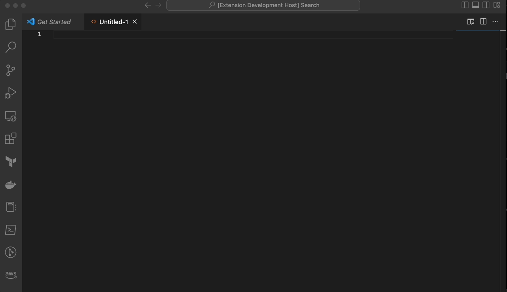

# Jones README

This extensions integrates with ChatGPT API and allows to get code snippets directly into vs code without using the browser.
The source code can be found in git repo: https://github.com/germanilia/jones

## Features

## Requirements

* You must be registered user to use ChatGPT api, you can complete the registratin in: https://openai.com/api/
* On your first usage you will be required to store you api key. The key can be obtained from openai webpage.

## Extension Settings

This extension contributes the following settings:

* `jones.ENABLED`: Enable/disable this extension.
* `jones.INLINE_QUERRY`: Activates the inline querry creatin using jones tags.
* `jones.MAX_TOKENS`: Max tokens to use default is: 3900.
* `jones.TEMRATURE`: Querry temprature, default is 0.7.
* `jones.MODEL`: Model to use, default is text-davinci-003

## Known Issues

Calling out known issues can help limit users opening duplicate issues against your extension.

## Release Notes

Users appreciate release notes as you update your extension.

### 1.0.0

Initial release of jones

**Enjoy!**
